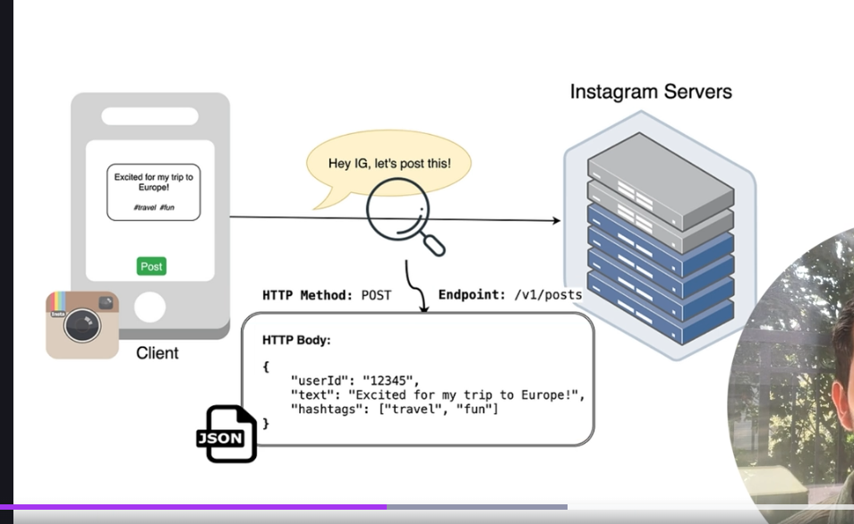
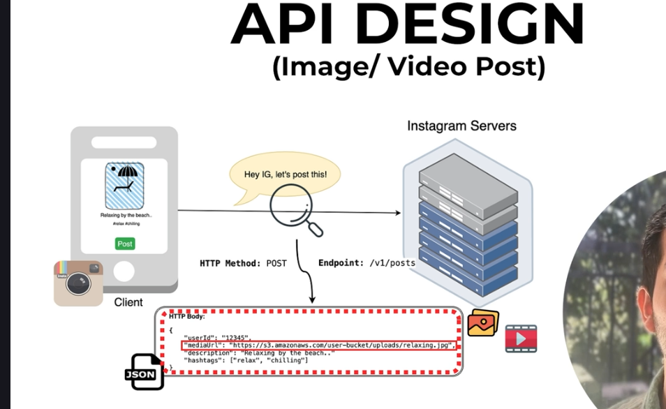
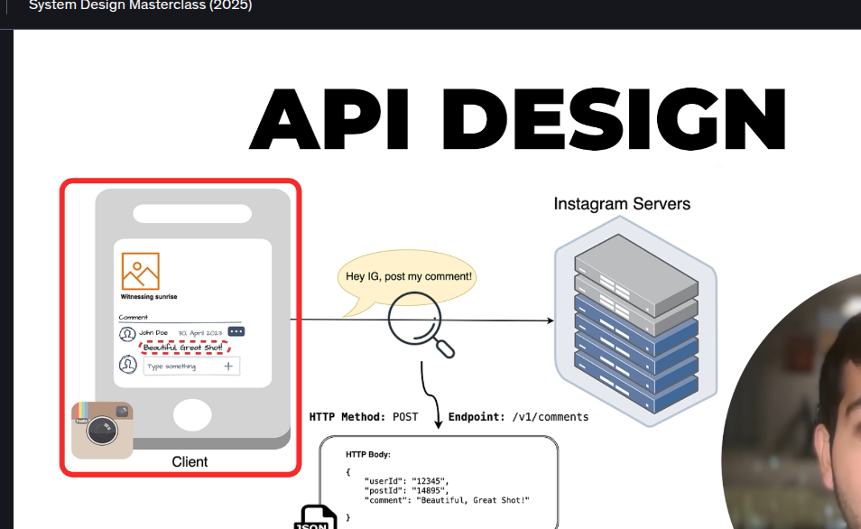
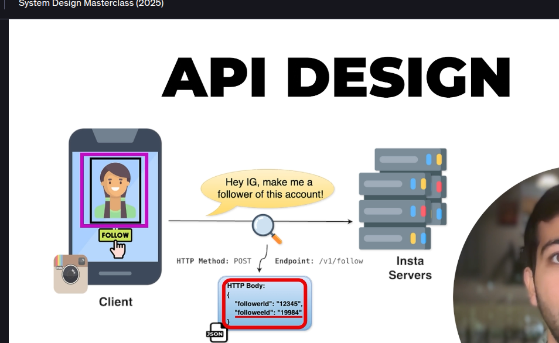

-> HTTP method tells us that what action we want to perfoem so basically Post,Get,Patch and all 
-> Api design to Image/Video Post
So small change in this request body we also send the media url 

Below is for like & Comment

-> API Design for follower and followee 
