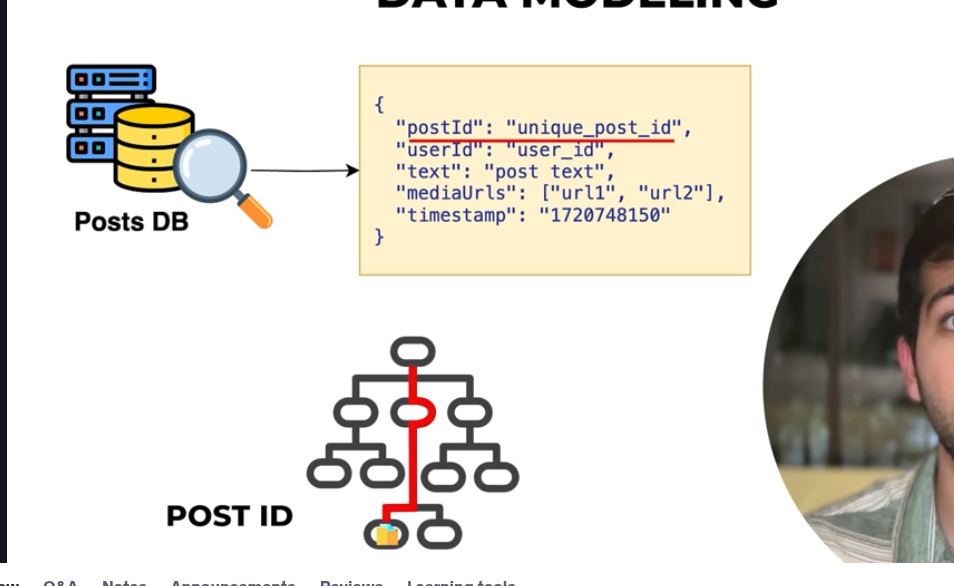
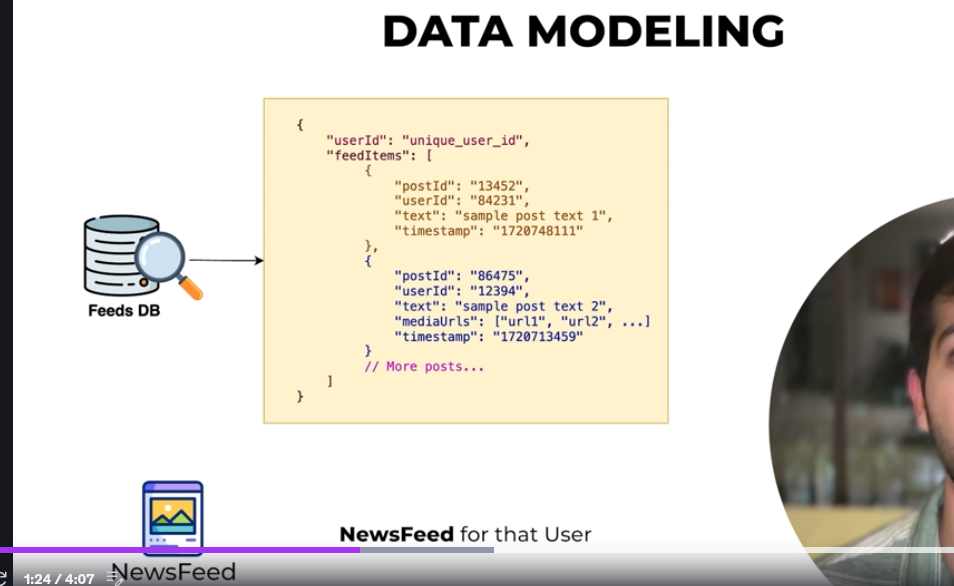
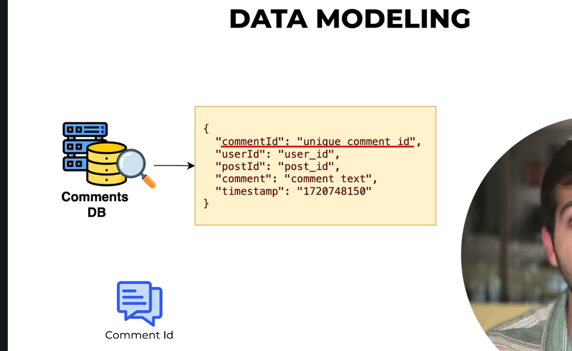

-> Indexing is the shortcut to quickly fetch the Data 

So basically in this for particular post we have the post Id and post Id is basically our indexing and indexing will help us to fetch the data from DB easilly 

So now fo over here for feed Db we have user Id so 

