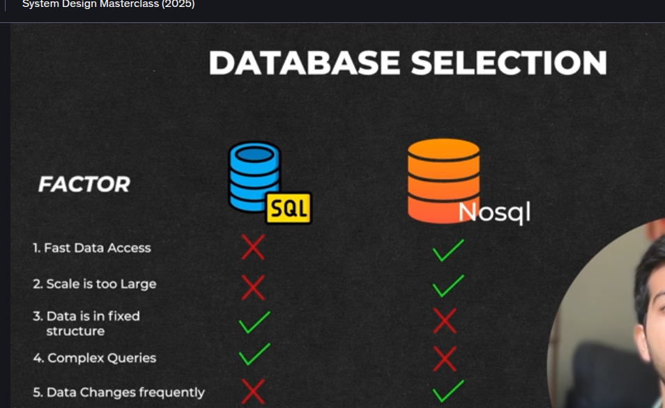
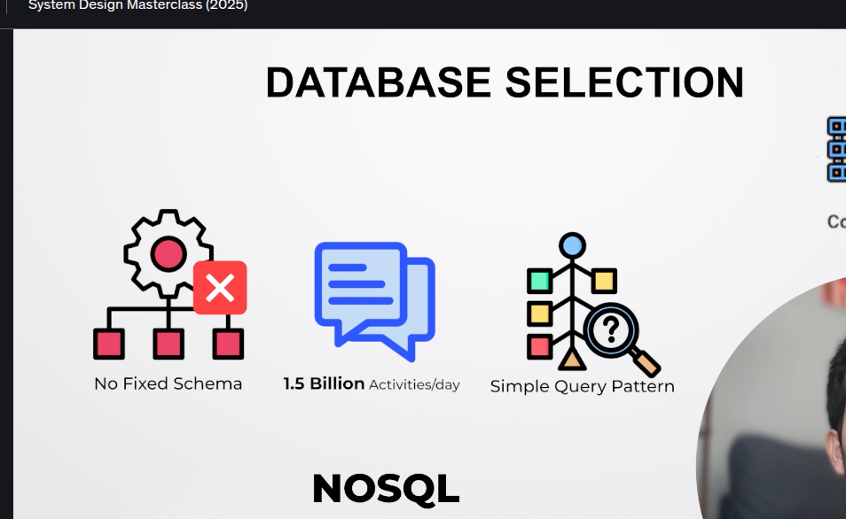

(1) Comparision between NoSql & Sql Database

SO in our case we have 5 database to work on that is Post Db, Comment DB, Like DB, FOllow/Unfollow Db , Read Db to fetch posts 
(1) SO first is POst DB so in that we donot have any specific structure basically we donot know ehat is coming vido,txt,image also queries are also simple hence we will prefer NoSql Databse for this 

(2) WHile for Fee also same this it is quite unstructured similar to posts stuff so in this also the query pattern is simple so hence the DataBase we will select is of NoSql
(3) COmment also has high throughput and no Fixed SChema so we will ove with Nosql for that also

(4) LIkes DB is similar to COmment only also fixed schema and simple query pattern we will take nosql for this

(5) While in case of follow and unfollow there is basically a proper relation between each users so in that case Graph DB is prefereed hence in that case basically node is our user and edges are his followers so we can consider in this way 