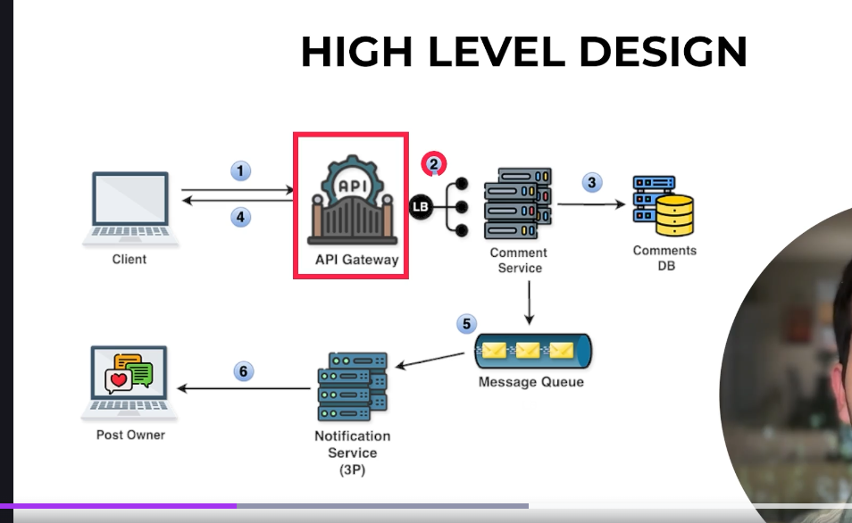

So simple flow userB comments on userA post and then via api gateway and loadbalancer request goes to the Comment service further comment will be stored in the comment DB and further omment service will add the object in key and value form in the Message queue baiscally userid and post id and the push to Notification service which will further notify the userA that userB has commented on thier post  also Notification service can be the third Party Service.
