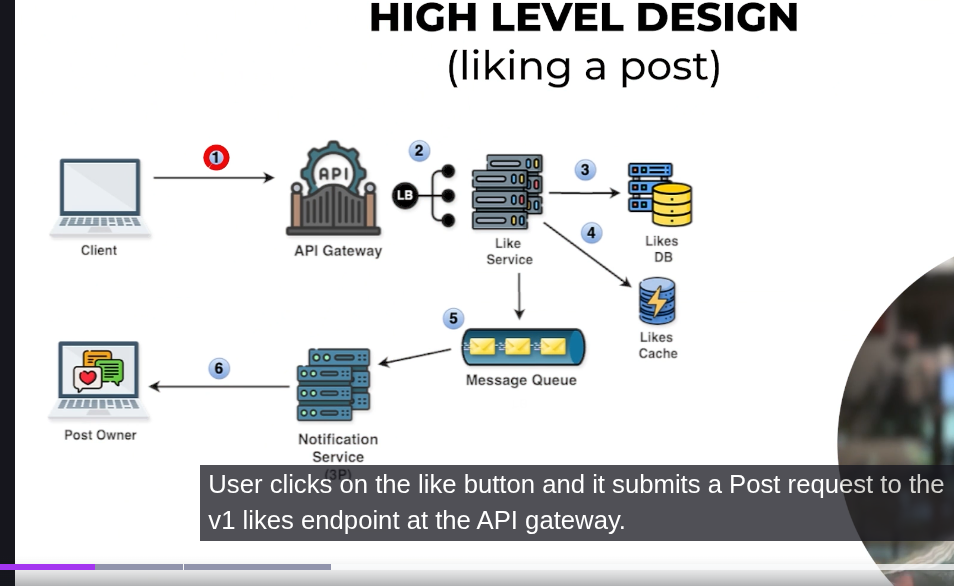

-> So it is same as the comment just what we do is simply add the cache so from like service first it gets stored to liked Db then message queue and along that it will store the like in cache so postA:likes so in this key and value form it is stored 
-> And then Notification and all it is as it is 