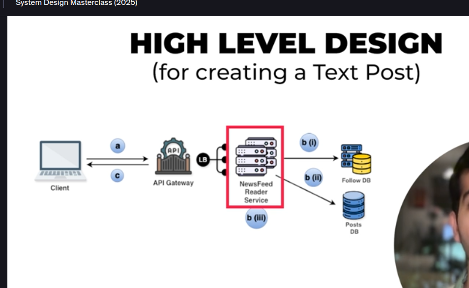

SO this is a simple request will go to api gateway which will further go to the api gateway then via loadbalancer it will go to the Postservice and then goes to the FB

Now second is the api deign for user to read the post so basically userA follows userb and userC so now further what happens over here is basically first our
system looks for whom does userA follow it sees userB and userC now from takes the userB and userC posts and then in third step it will arrange them in chnrono-logical order that is basically newest to oldest so userA can see the userB and userC posts 

-> BUt issue is when the user open the insta then everytime the read query will occur which will ideally increase the latency hence we need to optimize this more further beacuse currently first are reading users from the follow DB then we are checking the posts from the post Db and then in last we are arranging them in chronological order

SO first steps are same like userA will upload a post then via api gateway and post service that post will get stored in the PostDB and further more
now post writer service will make a key:value in the message queue so in that basically what will happen is for userA:postId will be stored in the message queue now from this queue one by one key will be removed and send to NewGeneratorFeedService via LOad Balancer which further will fetch userA key and against that key we have the value whihch is post Id so from post table it will take that post and then further from follow DB i will take user A followers and then now it will send to feeds db and cache so the followers of userA can see that feed in their device
