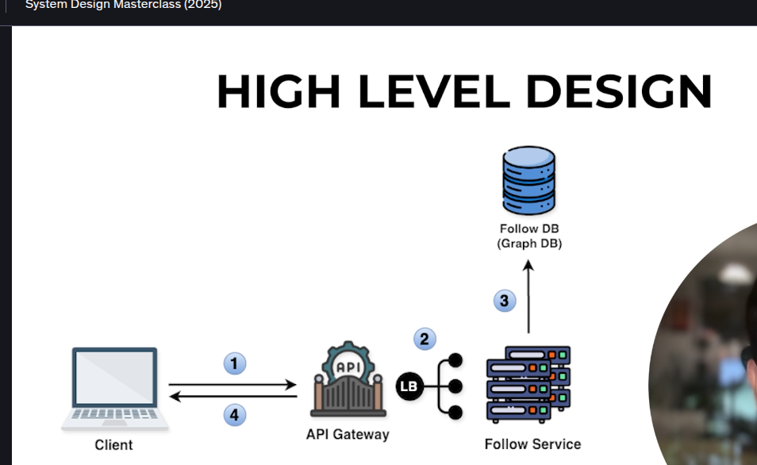

-> So from image we can see that when a user follows another user then then request is sent to the API Gatway where further basically the request will be handled
-> Now further over here now via LoadBalancer the request will further go to the Follow service whihc will further query our Graph Database
-> So main benifets of using Graph Database is basically this is specilaized in storing the relationship Data
-> 