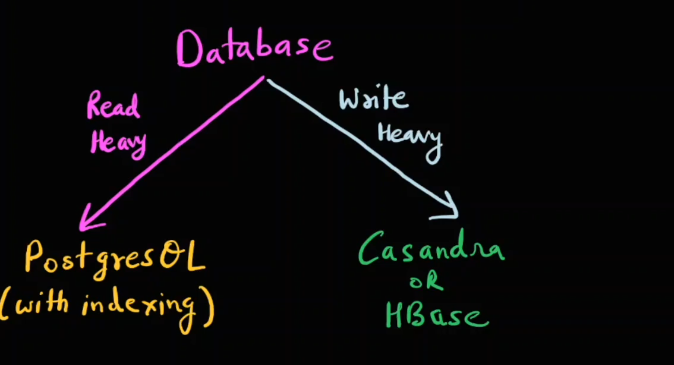

-> Why Capacity Estimation
1. To determine number of servers and DataBases
-> So baically after knowing the DAU & MAU and throughput we will get an idea about how much we will require the number of the server and the DataBases
-> So in ideal scenario what will happen basically lets say our throughput is 10 million req per seconds but our server can handle only 1 million req per second so in that case we will need 10 more server to hanfle 

2. Cost Management 
 So basically in some scenario it may have happened we over scaled out system and increased the server too much which we will not need so to manage that we need to do Capacity Estimation

3. Decide type & specifications of all the hardware (server,databases and all this kind of hardware)
-> So in simple terms lets say your requorement is of 10 million queries/ hr and we have two choice of the DataBase SQL & NO SQL so in that case lets say SQL can handle 50k queries and nosql 1million quries so in that case we will go with NoSql data base hence we do capacity estimation so we can get an idea of which data base will serve our purpose according to our requirements 

4. Capacity Estimation will help us decide our sytem is read heavy or write heavy
So there is major impact in the selection of the Database if we say that our system is read heavy or write heavy this can imapct our database selection if our system is read heavy we will go for Postgresql or  if it is write heavy we will go for Cassandra 
_-L> 
