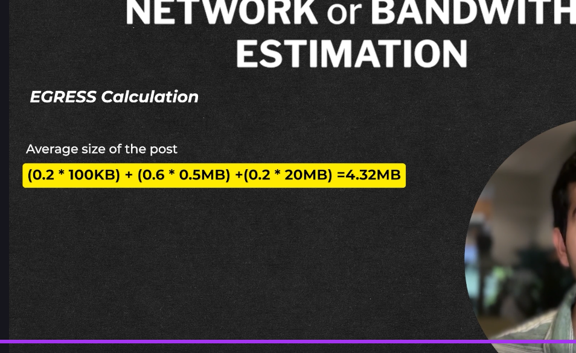

-> This is important as this tells us the how much data goes in and comes out  
-> Data flowing into our system per second is called as ingress and data outgoing is called as Egress
-> So as per our calulation  we caluclated 216 Tb per day but to calculate ingress we need to calculate the data coming in a second so that will be
(216 TB) / (24 * 60 * 60) whihc will be ingress persecond
-> While ergress we assumed that we had 50 Billion read request /day so egress will simply be 50 Billion
so post can be of 4.32 mb 
 
 so 50 Billion read request * 4.3 mb / (24*60*60) will be our read requests per seciond hece we can call it as our egress