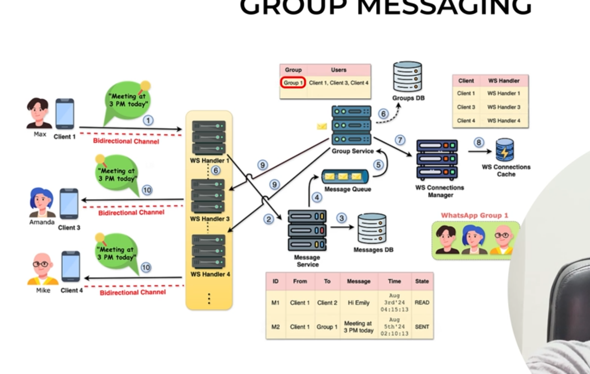

-> So in this first message is sent by the Client 1
-> Client 1 -> Sends the Message the call goes to the websocket handler 1 -> Message service
-> Message Service -> DB (where all the details are stored in the DB)
-> Message Service will stroe this into Message queue -> Message Queue
-> Message Queue -> Group Service (So now using the Group Id Group Service will fetch all the details of the Group from the Group DB)
-> Group Service (after fetching Group Details from Group DB) -> WS Connections Manager will be called to and from the client and websocket info will be fetched
-> And after getting back the ws handler details group service will further send the message to all the responsible clients 