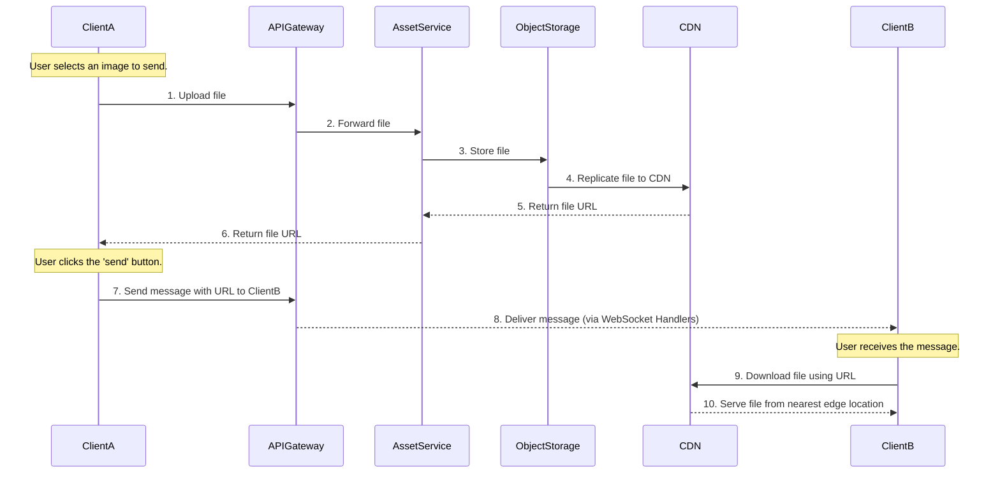

## High-Level Design: Sending an Image or Media File

This document outlines the process of a user (Client A) sending an image or any media file to another user (Client B). The process is optimized to ensure that the file is uploaded and ready for delivery even before the user hits the "send" button.

### Step-by-Step Flow

1.  **File Selection and Pre-Upload:**
    *   When **Client A** clicks the attachment icon and selects a file (e.g., an image), the client application immediately starts uploading the file to the backend. This happens in the background before the user even confirms sending the message.
    *   The client sends the file to the **API Gateway**, which routes the request to the **Asset Service**. The Asset Service is a dedicated microservice responsible for handling media uploads and management.

2.  **Storage and CDN Processing:**
    *   The **Asset Service** receives the file and uploads it to a durable **Object Storage** solution (like Amazon S3, Google Cloud Storage, etc.).
    *   Once the file is stored, it is pushed to a **Content Delivery Network (CDN)**. The CDN distributes the file across various edge locations globally.
    *   The CDN generates a unique, optimized URL for the uploaded asset.

3.  **URL Return and Message Composition:**
    *   The CDN URL is returned to the **Asset Service**, which then sends it back to **Client A**.
    *   By the time Client A is ready to send the message, the file has already been uploaded, and the client has the CDN URL.

4.  **Sending the Message:**
    *   When Client A clicks the "send" button, the client sends a message containing the CDN URL to Client B.
    *   This message follows the same real-time text messaging flow: `Client A -> API Gateway -> WebSocket Handler 1 -> WebSocket Handler 2 -> Client B`.

5.  **Receiving and Downloading the File:**
    *   **Client B** receives the message containing the CDN URL.
    *   Client B's application can then use this URL to download the image directly from the nearest CDN edge location, ensuring a fast and efficient download experience.

### Pictorial Representation

