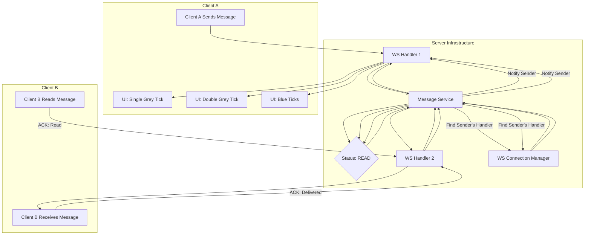

## High-Level Design: Message Status and Read Receipts

This document explains how WhatsApp manages and communicates message statuses (e.g., Sent, Delivered, Read) between clients.

### Core Concept

The process relies on the client application sending acknowledgments back to the server upon receiving and reading a message. The server then updates the message's state in a database and notifies the original sender of the status change.

### Step-by-Step Flow

1.  **Message Sent (Single Tick):**
    *   When **Client A** sends a message, it travels to its connected WebSocket Handler (**WS Handler 1**).
    *   WS Handler 1 passes the message to the **Message Service**, which stores it in the **Message Database** with an initial status of `"SENT"`.
    *   The Message Service immediately confirms to WS Handler 1 that the message is stored.
    *   WS Handler 1 notifies Client A, which then displays a **single grey tick** to indicate the message has been successfully sent to the server.

2.  **Message Delivered (Double Tick):**
    *   The message is forwarded to Client B's WebSocket Handler (**WS Handler 2**), which delivers it to **Client B**'s device.
    *   Client B's application, upon receiving the message, automatically sends a `"DELIVERED"` acknowledgment back to WS Handler 2.
    *   WS Handler 2 informs the **Message Service** to update the message's status to `"DELIVERED"` in the database.
    *   The Message Service then needs to notify the original sender, Client A. It queries the **WebSocket Connection Manager** to find which handler (WS Handler 1) is connected to Client A.
    *   The Message Service relays the "delivered" status to WS Handler 1.
    *   WS Handler 1 sends a notification to Client A, which updates the UI to a **double grey tick**.

3.  **Message Read (Blue Tick):**
    *   When **Client B** opens the chat and reads the message, the application sends a `"READ"` acknowledgment to **WS Handler 2**.
    *   WS Handler 2 informs the **Message Service**, which updates the message's status to `"READ"` in the database.
    *   Following the same process as the delivery receipt, the Message Service looks up Client A's handler (WS Handler 1) and sends the "read" status update.
    *   WS Handler 1 notifies Client A, which then turns the double ticks **blue**.

### Flowchart Representation

