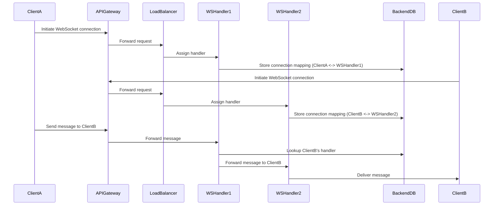

## High-Level Design: How WebSocket Connection is Established

This section explains how a WebSocket connection is established and managed in a scalable messaging system like WhatsApp.

### Step-by-Step Flow

1. **Client Initiates Connection**  
    The client initiates a connection by sending a request to the **API Gateway**.

2. **API Gateway Forwards Request**  
    The API Gateway forwards the request to one of the **WebSocket Handler Servers** (selected via a Load Balancer).

3. **WebSocket Handler Establishes Connection**  
    The WebSocket Handler establishes a bidirectional WebSocket connection with the client.

4. **Connection Mapping**  
    Each client is mapped to a specific WebSocket Handler. This mapping is stored in a backend table (e.g., `WebSocketConnections`), which keeps track of which handler is connected to which client.

5. **Message Flow**  
    - When **Client A** wants to send a message to **Client B**:
      - Client A sends the message (with recipient ID) to the API Gateway.
      - The API Gateway forwards the message to the appropriate WebSocket Handler via the Load Balancer.
      - The WebSocket Handler checks the backend table to determine which handler is connected to Client B.
      - If Client B is connected to a different handler, the message is routed to that handler.
      - The target WebSocket Handler delivers the message to Client B.

6. **Connection Management**  
    A **WebSocket Connection Manager** manages all active connections and maintains a cache for quick lookups.

### Pictorial Representation

### Summary

- Each client connects to a WebSocket Handler via the API Gateway and Load Balancer.
- Connection mappings are stored in the backend for efficient message routing.
- The WebSocket Connection Manager and cache ensure quick and reliable delivery of messages between clients.
