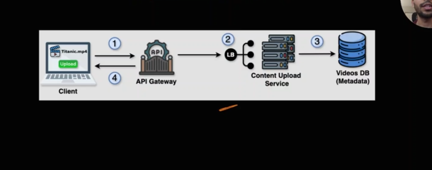
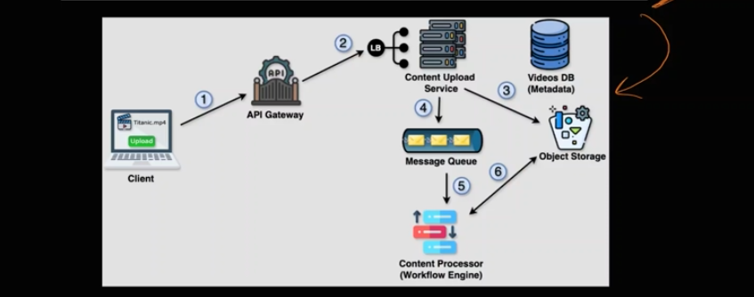

-> Step 1:Requirements
-> So there are two types (1) Functional (2) NonFunctional
-> FUnctional basically will you decide what our current system does 
-> Non functional is thr optimiazation how optimal is out Application

2-> Step -2 Capcity Requirements
-> Throughput (Throughput means how many requests our system process each second)
-> DAU/MAU (Daily Active Users & Monthly Active Users we talk about here)
-> Storage
-> Network Bandwith (In Network or bandwith we talk about how much data comes in or goes out)

-> So basically Throughput means 100 million requests we can handle while for  each (100 million * 10 mb)/second data can be processed
-> So once we basically caluclate this we are done with the Capacity Requirements

3-> Step 3 API Design
-> EndPoint : Door to your specific part of the system 
-> Body : Body is basically the data we send with the request 
-> Response : This will the output

-> All of the above are the part of the Low Level Design

4-> High Level Design

-> So above is the simple design but when we see the issue we add more and more objects to make out product optimized

5-> Deep Dive
-> In this section we talk about DataBase selection , DataBase Modelling and Caching 

