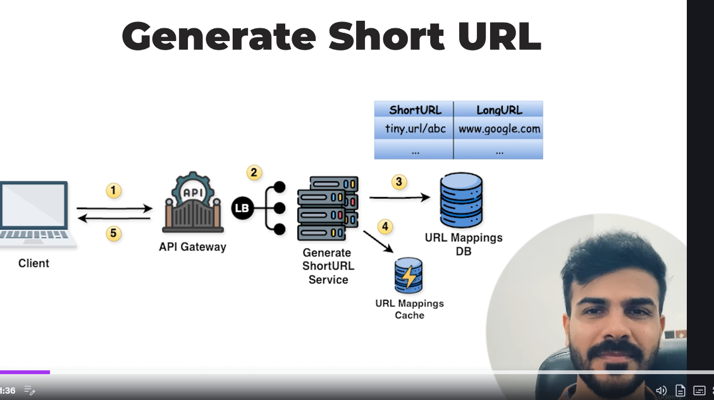

So in this we give the short url to the TinyUrl Service and this gives back the short url here it will be get method basically we will send the short url in paramsna dn the in db it is already stored for particulart short url we have a long url so we will get it back

-> High Level Design to get short url
 apisdesign for short url

Here same from apigateway to Generate ShortUrl service via loadbalancer and then gets stored in url Mapping DB & Url Mapping Cache to shre the long 