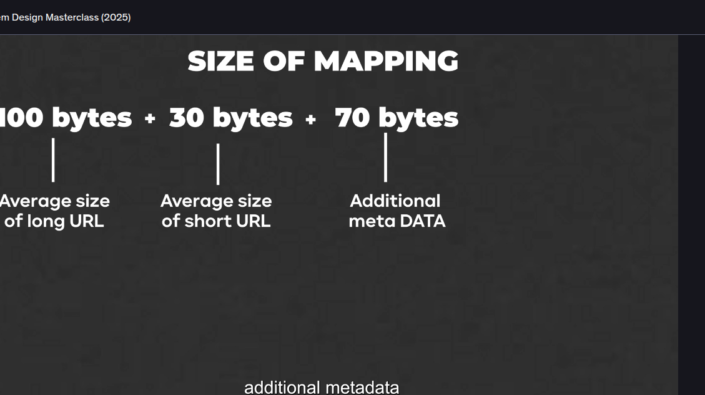

So avg size of long url can be considered as 100 bytes
Avg size of short url is 30 bytes and other metadata size is 70 bytes hence we can consider the avg size is 200 bytes 
and we have daily 150 million short url creation request per day hence this will become 150 million * 200 bytes of size that will be our total storage per day 