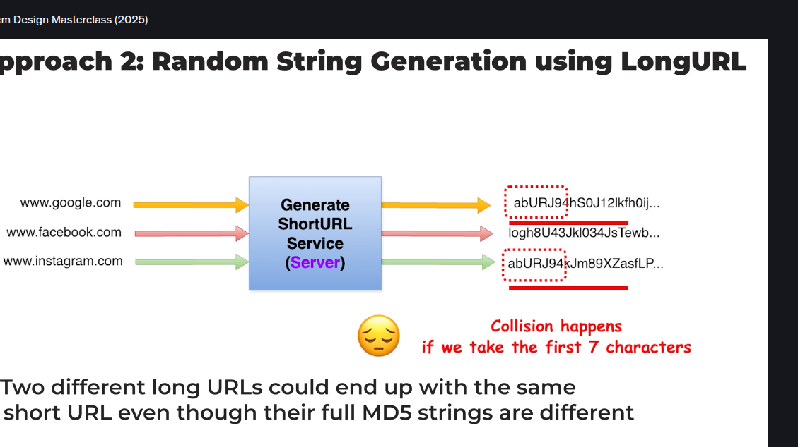
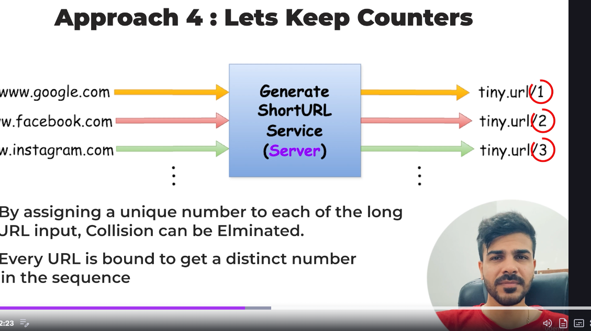
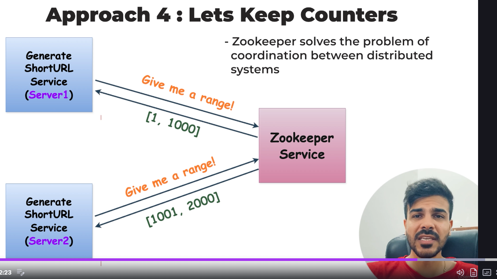
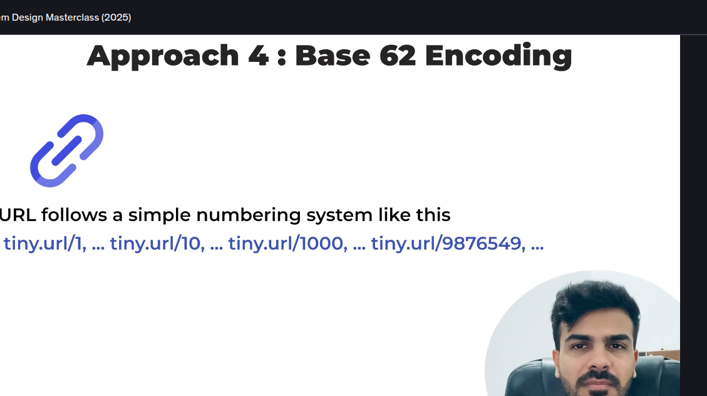
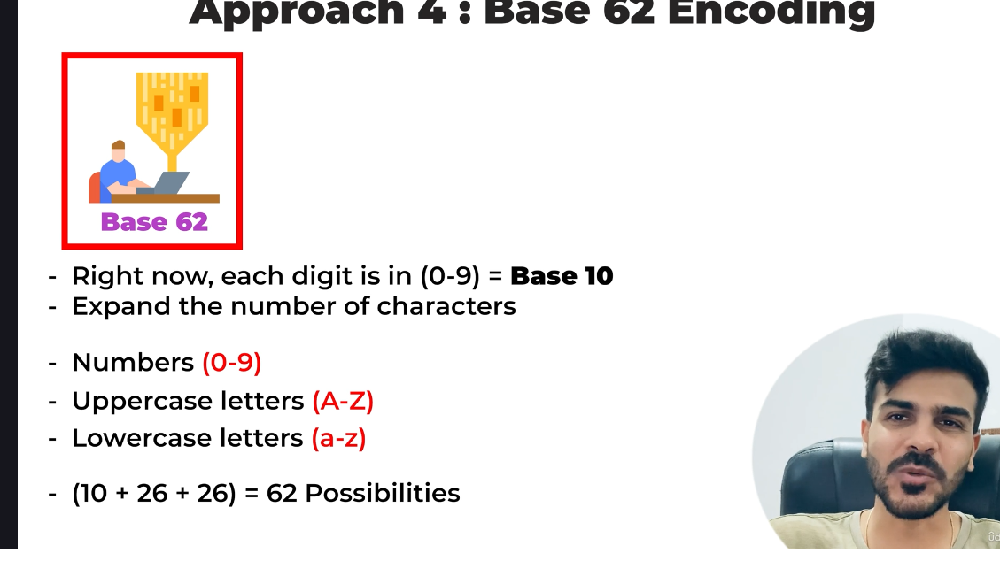

-> So for this application we need to take care about several things so basically main is for particualr long url there will be unique short url always so basically before generating short url we need to check if that url exists in DB Or not 

(1) Approach 1: Random String Generation
-> So the one way to avoid generation of similar string for multiple long url there are many algos available we can use them to avoid the issue whihc helps in genrate random unique string 
-> But issue is that we run the same algo on two different server then in that case we cannot gurantee of unique coz there may be chances of getting same short url for single long url in the 2 different servers

(2) Approach 2 : Another is we can use the MD5 so basically MD5 allows us to do so by Generating short url based on the long url so basically it will take the long url and from that it generates short url so hence for 2 different long url there will never be possible to have same short url for 2 differetn long url
BUt issue if MD5 generates the unique string but the output of the MD5 is very large so our main issuse still exists

(3)Approach 3
So in this basically as short url is generated we will check that in DB and if in DB that does not exists then in that case we will move ahead but if exuists we will generate new short url and check in db till we make a short url but this will cause an issue of latency our systm will face high latency due to this as the everytime DB serarch query will occur and as user incrreases the size of DB also increases which will further take good amount of time 

(4) Approach 4 : Using The Counters 
-> 
So what we can do is in generated url we can place a counter which will increase everytime and hence further due to that we can avoid the collision but in this catch is basically if we run this algo independently on any other servece and there is issue that 2 long url have same short url in the diff servers

So in this case zookeper comes in this solves the issue of coordiantion between distributed systems so basically for two different servers so zookeper will assure that it will give the different and unique counter which will make the url unique
So basically we will guve the range so basically lets say there are two service serviceA and servicebB so now basically fo serviceA zookeper provides the number between the range 1 to 1000 and for serviceB the zookeeper provides the number bertween the range of 1000-2000 so in this way we can avoid the same number issue 
-> Base 62  Encoding : 

So currentlt our system follows sytem numbering so starting from 1 and then moving further 8000000,900000 and so on hence as we keep going the length of our url grows 
So currently our numbers are Base 10 which means numbers are between 0-9 but lets say if we increase the possibility that is one number from 0-9 , character from A-Z and another character from a-z so in this way we increase the possibility hence due to whihch we can avoid long number issue