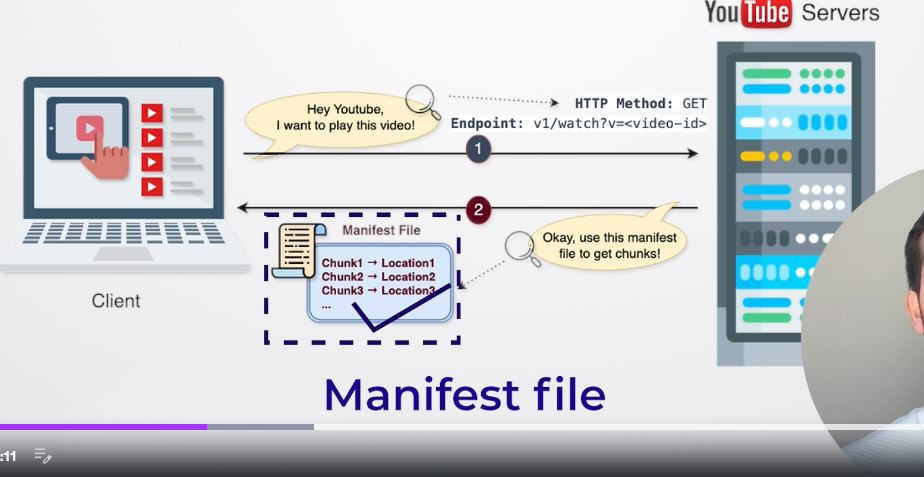
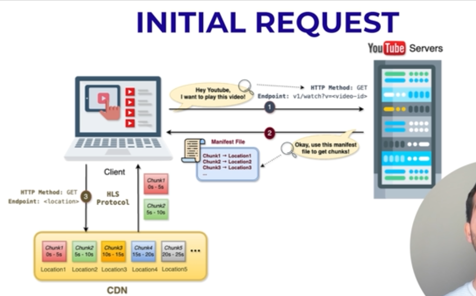
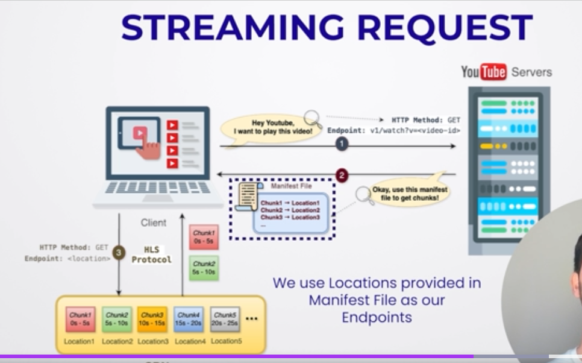

-> So basically when we try to stream any video in Yt then in that case in the single reques the video won't come to you basically slowly slowly in chunks the video will come upon from the youtube server so basically in small chunks you will receive the video and this all chunks are stored at different location in the youtube sever

-> So now over here basically once the request is sent to the YT server then in that case we willbasically tell the server whihc video we want to play now theis video is stored in small small chunks at different locations so now youtube will send the manifest file whihc has all the chunks location of that video
-> 
-> So now further over here using that manifest file again it will basically send the manifest request to the srtreaming 
-> Also the video chunks we are talking are not stored in server instead they are stored in CDN (Content Delievery Network)
-> So basically CDN helps to load large assets like media 

okay after recieving manifest file now further more basically we will send the get req with the file  to CDN where our chunks are stored at that particulat location and that is done BY HLS protocol so this HLS provides the adaptive streaming facility that means the quality of video can get adjusted based on the users internet speed 