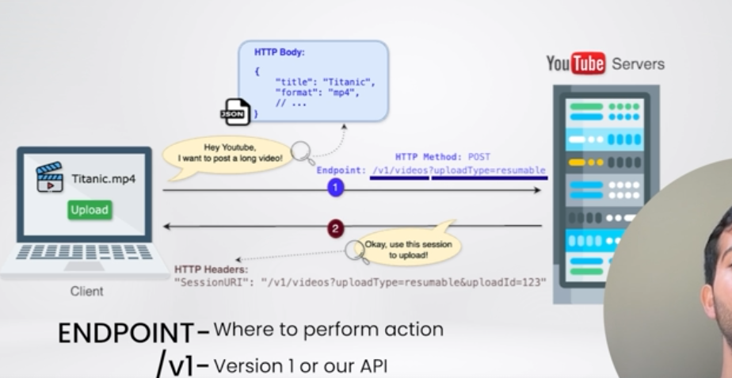

->So here we have two things one is Streaming the Content and UPloading the Content
-> Before we start fo uploading the Content one thing to know is the video that is being uploaded can be of either 10 min or 2 hrs hence it is not feasivle to upload vide on signle request hence 
multiple chunks of data is being sent to upload the video 

-> Also the upload type should always be reuploadable like on case once it get pause our server can tell the user to reupload the video
-> So basically our flow is like that first client sends the req to the YT server with the mp4 video then this is saved  in server and further server responds back with the session uri and then this session uri is used when client tries to upload the video content to the youtube so first client does post request where data is sent in the body and second will be put method
->