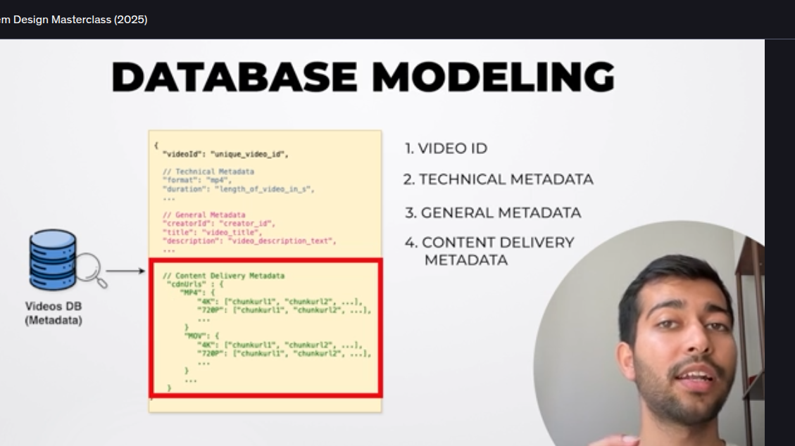

SO our Data Modell will be like this 
-> We will have the video Id
-> Then we will have Technical Metada which has format duration and all stuff
-> FUrther we will have General MetaData
-> Content Delievery MetaData which as all the stuff like cdnUrl, format of the video and where that video is being stored basically the chunks of that video in serveral different formats 