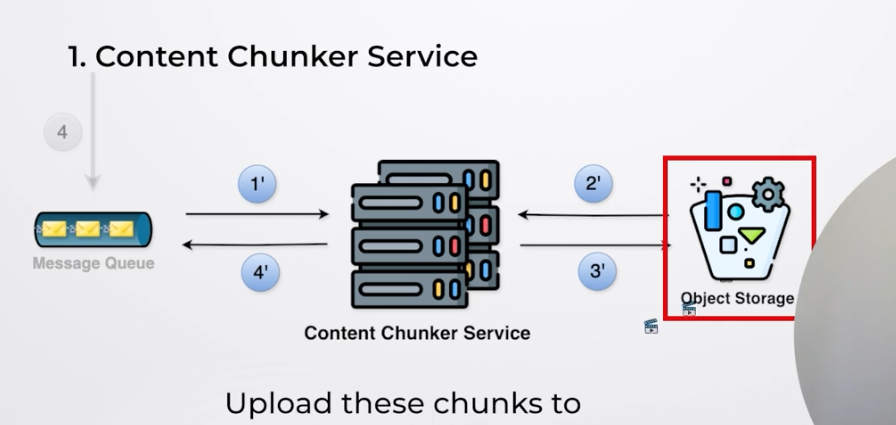
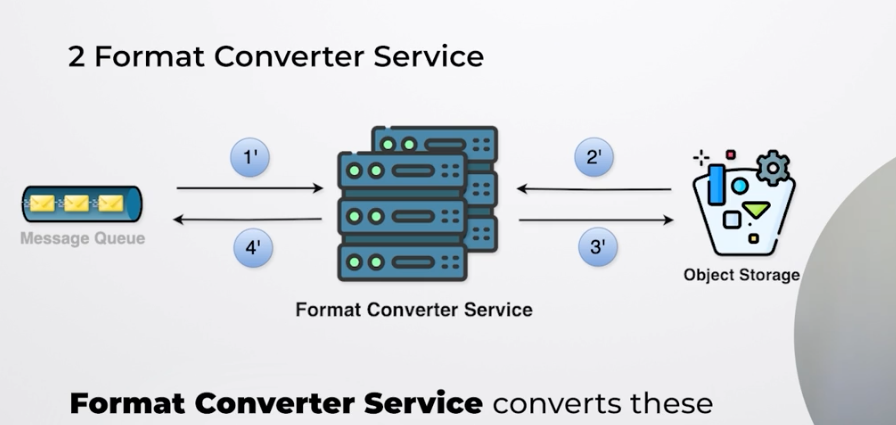
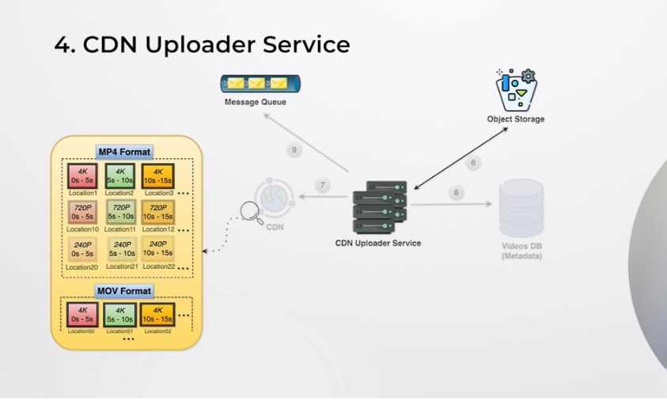

(1) So first content chunker service retrieves content from the Message Queue and then it uses user Id and from Object Storage based on the user id it fetches the video and then it breaks that video into chunks and then again it uploads chunks to the Object Storage 

(2) FOrmat chunker service

The format Chunker service will basically convert these individual chunks into different formats 
(1) So first it retrieves event from the Message Queue here we also have the chunk Id basically this is the chunk id like what previously chunk service broke the videos into chunk now format converter service has acess to those chunk id stored in the Object storage and then it grabs it and convert into differetn fimat and then it uploads the converted chunks to the Object Storage and further for each event with the chunk id it adds it to the Message Queue 
(3) Quality Converter Sevice
(1) So we also have Quality Convertor Service also to convert the videos of different quality so whihc will be helpful for good user experience 
(4)  Content Delievery Network 
-> CDN Uploder Service 
CDN Basically retrieves this chunks from the Object Storage and then uploads it to CDN 
