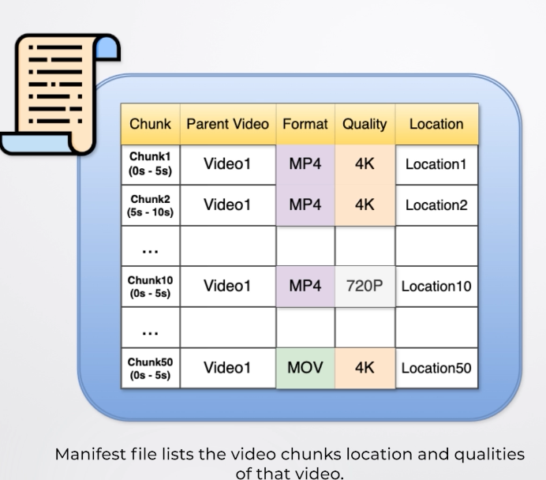
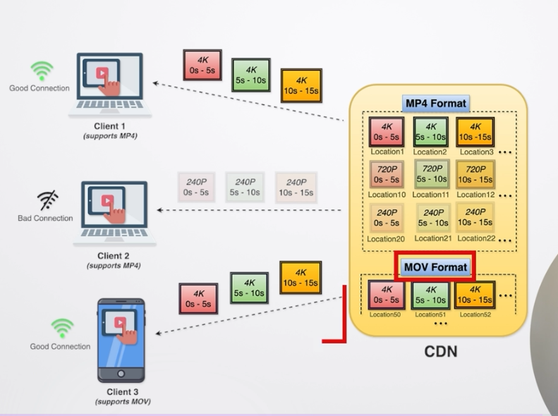

Step 1 
-> Here basically client sends the request to the Youttube Server that he wants to play that specific video so for that client will send a videoId of the video to the YT server on which server returns the manifest file and the other required metadata 

Manifest files looks something like above it has the Video Quality and location of the video where it is being stored and what is the quality  
And after this manifest files are sent to the CDN and further CDN accepts that chunk and then delivers the video asper the requiremnts on the basis of the HLS Protocol

