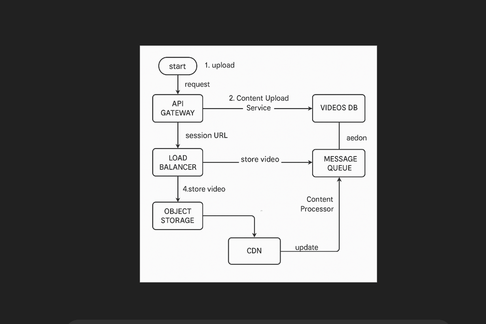
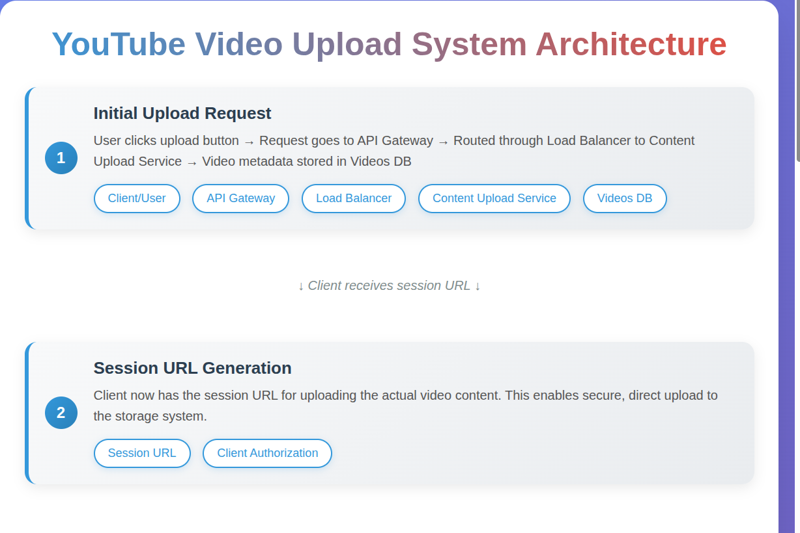
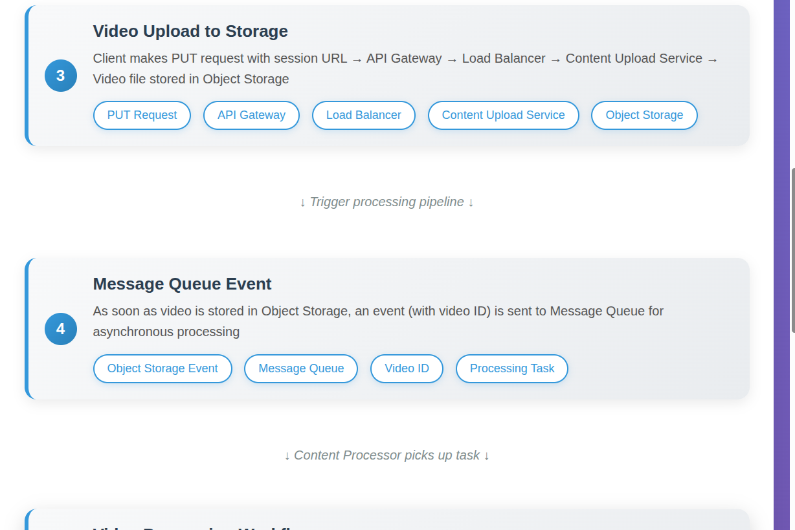
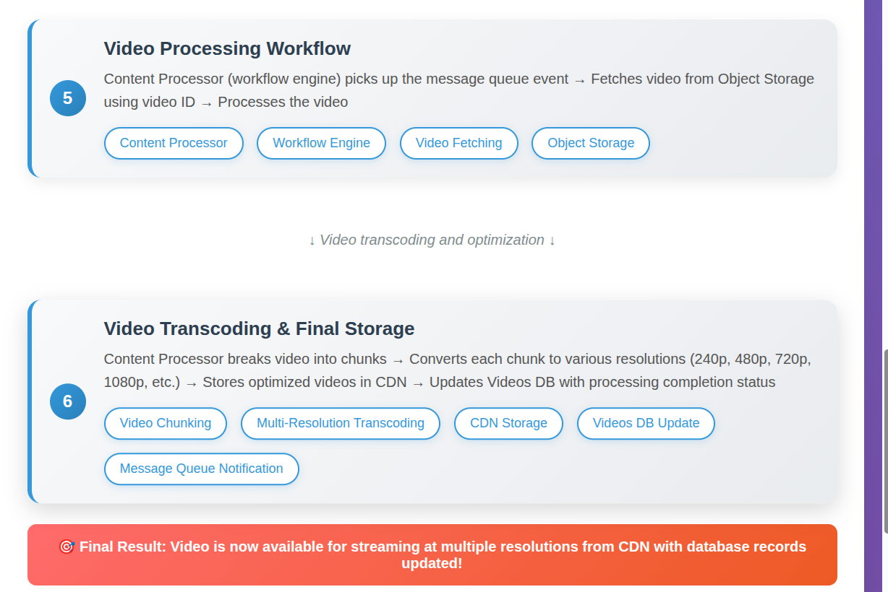

-> So till now for upload we have seen that we send the vidoe with the metadata anf then server responds with the session url 
-> So step by step
(1) So when user click on the upload button the first request goes to the Api Gateway and further that is sent to Content Upload Service via LoadBalancer and then it adds to the our Videos DB Database
(2) Now the client has the session url so now further client does the put request 
(3) So now basically over here client call goes tot api gatway which basically has our session url and then this will go to content upload service via load balancer and then content upload service stores the video in the Object Storage 
(4) So as soon as it is added in the Object Storage we will send it to the Message Queue so basically meesage queue has basically tasks so further another service or anything will further pick that up 
(5) Furthermore there is a content Processor which is basically our workflow engine so in mesage queue we have an event and video Id now further content Processor will fetch that videoId and look for that video Id in Oject Storage 
(6) And further content Processor breaks down the video in small small chunks and each chunk is converted to vaious resolution and further it stores that into CDN and then after this content pROCESSIOR WILL TELL THE MESSAGE QUEUE TO ADD THIS TO THE Video DB

FLow chat : 

