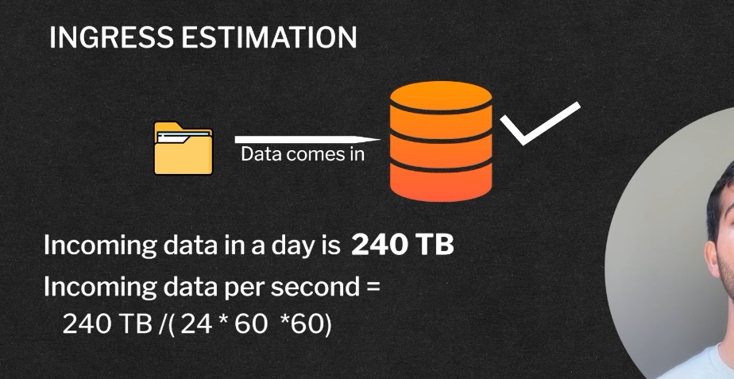

-> Network Bandwith estimation tells us about the howmuch data flows in and out if the system 
-> Ingress Estimation : 

-> Egress can be counteb by knowing that how much Data is flowing out of our system for out case we Have 1 Billion request/Day hence we can say that we have abound 1 billion(24*60*60) Billion request per day